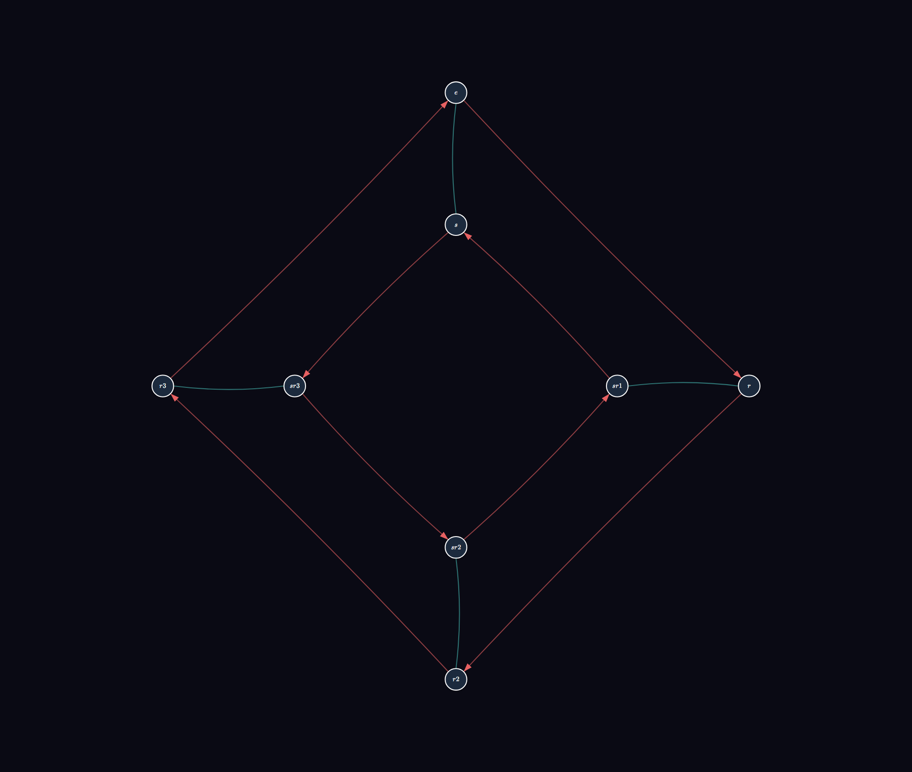
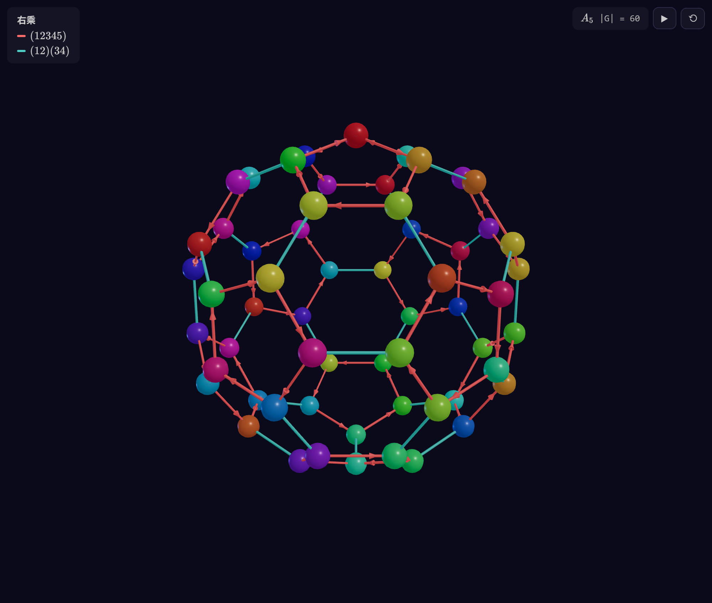
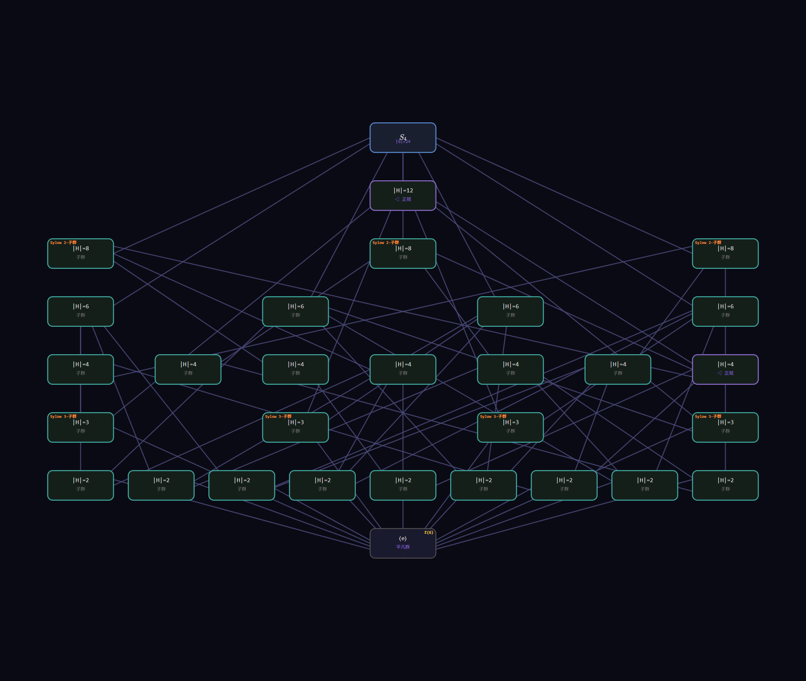
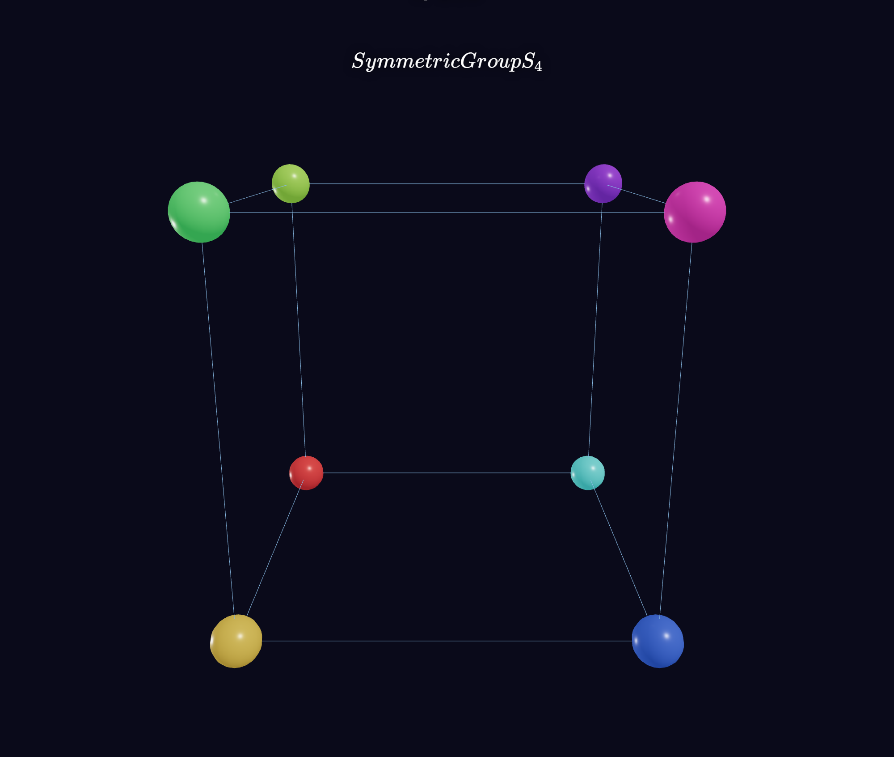
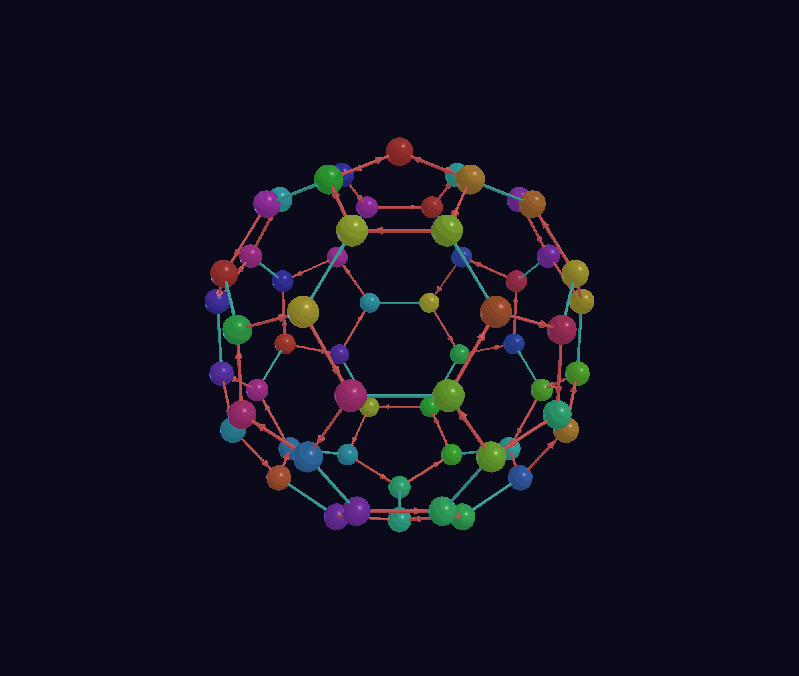
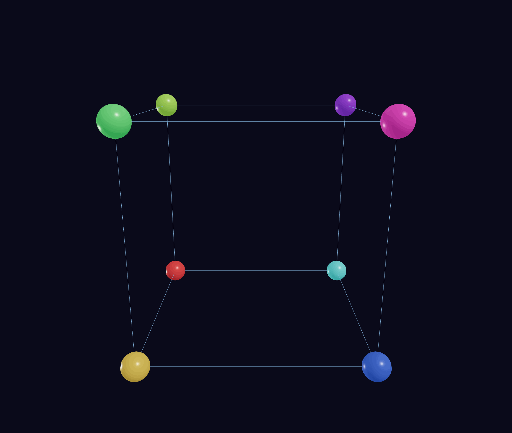
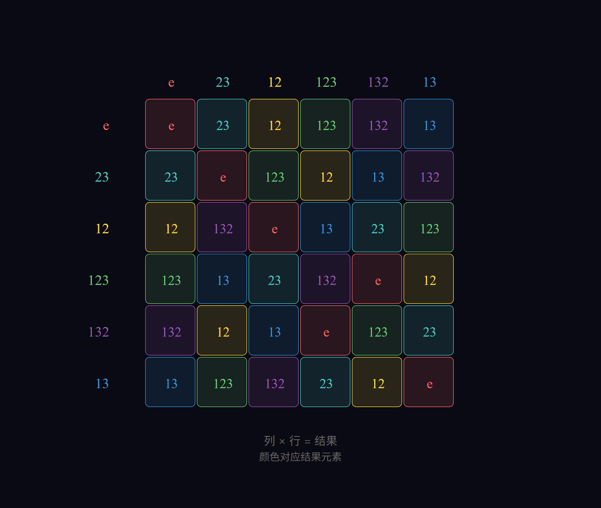
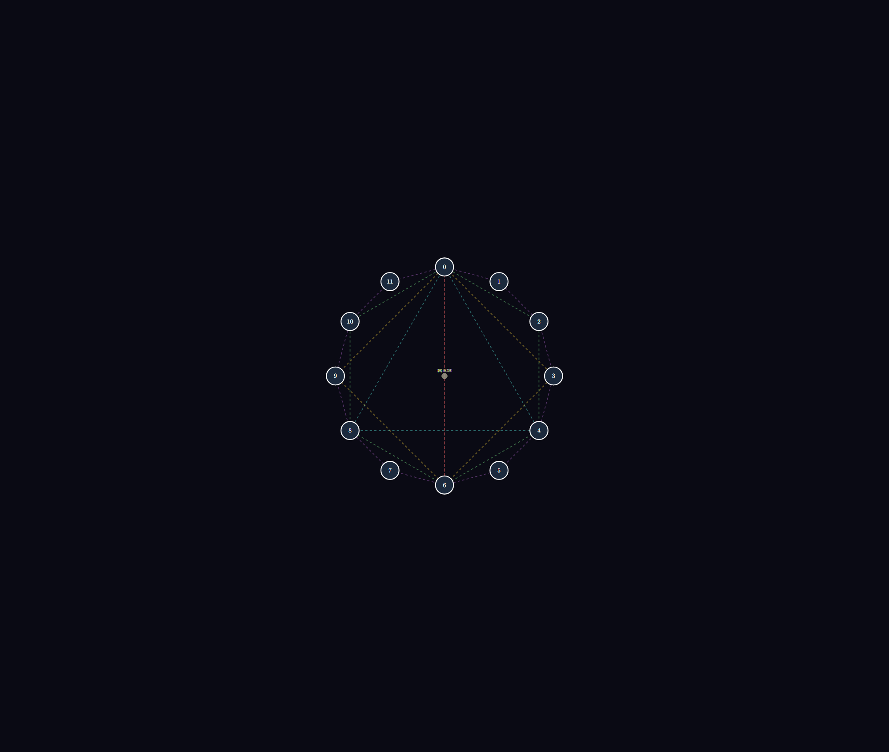

# GroupViz

<p align="center">
  <strong>群论可视化交互工具</strong>
</p>

<p align="center">
  <a href="https://rrcathy.github.io/GroupViz/"><strong>在线体验</strong></a> ·
  <a href="https://github.com/rrCathy/GroupViz">GitHub</a> ·
  <a href="https://github.com/rrCathy/GroupViz/issues">获取帮助</a>
</p>

<p align="center">
  
  
  
  
</p>

<p align="center">
  <a href="./README.md">English</a> | <a href="./README_zh-CN.md"><strong>简体中文</strong></a>
</p>

---

## 🎯 让抽象代数变得可见、可玩

**GroupViz** 是一款交互式 Web 应用，把抽象的群论变成可交互、可探索的 2D/3D 场景。无论你是研究子群结构的研究者、讲解凯莱图的教师，还是初次接触 Lagrange 定理的学生——GroupViz 让数学变得看得见、摸得着、玩得转。

**核心亮点：**
- ✨ 13 种视图模式：凯莱图（2D/3D）、乘法表、子群格、对称性视图、陪集条带、轨道与 Sylow 视图等
- 🎨 18 种 3D 形状模板与 14 种 2D 布局，按群性质自动分配
- 🏗️ 完整的群构建系统：直积、半直积、自同构群、商群、同态与群展示（⟨S|R⟩）
- 🔄 多视图浮动窗口、深/浅主题、2D/3D **动图 GIF 导出**
- 🌍 中英双语界面，会话保存与恢复

<br>

<div align="center">



*二面体群 D₄ 的凯莱图（2D 双环布局）*

</div>

## 📸 视图画廊

<div align="center">

### 凯莱图

| 2D 双环布局 | 3D 多面体形状 |
|:---:|:---:|
|  |  |

### 结构与定理

| S₄ 子群格 | S₄ 对称性视图 |
|:---:|:---:|
|  |  |

### 动图演示

| A₅ 3D 凯莱图旋转 | S₄ 对称性作用动画 |
|:---:|:---:|
|  |  |

### 乘法表与圆圈图

| S₃ 凯莱表 | C₁₂ 圆圈图 | C₂₀ 元素集合 |
|:---:|:---:|:---:|
|  |  |  |

</div>

## ✨ 功能亮点

- **群结构一目了然** —— 子群、共轭类、中心 Z(G)、正规化子/中心化子、Hasse 子群格（叠加导列/中心列/合成列）
- **广义凯莱图** —— 边由*任意*群元素定义（右乘/左乘可切换），不限于生成元
- **定理可视化验证** —— Lagrange（陪集条带 `|G| = |H|·[G:H]`）、Cayley（正则作用）、轨道-稳定化子、第一同构定理动画、Sylow 定理
- **群构建实验室** —— 交互式构建 G×H、N⋊_φ H、Aut(G)、G/N 与同态
- **群展示系统** —— 通过展示 ⟨S|R⟩（Todd–Coxeter 陪集枚举）定义任意有限群
- **记号导入** —— 输入 `S₅`、`PSL(2,7)`、`C₃×D₄`、`Aut(S₄)` … 即可得到该群及其凯莱图与完整结构管线
- **混合计算** —— 小群本地 TypeScript 计算，大群（阶 > 60）自动切后端 FastAPI + GAP 引擎，带本地兜底

## 🚀 快速开始

在线体验：<https://rrcathy.github.io/GroupViz/>

或本地运行（Node.js ≥ 18，npm ≥ 9）：

```bash
git clone https://github.com/rrCathy/GroupViz.git
cd GroupViz
npm install
npm run dev
```

浏览器打开 `http://localhost:5173/`。大群（阶 > 60）需要启动后端：

```bash
cd backend
pip install -r requirements.txt
uvicorn main:app --reload --port 8000
```

初次使用？[新手教程](docs/TUTORIAL_zh-CN.md)带你快速上手工作台、13 个视图与构建系统（English: [TUTORIAL.md](docs/TUTORIAL.md)）。

## 🛠 技术栈

| 层级 | 技术 |
|-------|-----|
| 框架 | React 19 + TypeScript |
| 构建 | Vite |
| 3D 渲染 | Three.js + React Three Fiber |
| 数学渲染 | KaTeX（所有数学表达式规范排版） |
| 后端 | Python FastAPI（大群混合计算，可选 GAP 引擎） |
| 测试 | Vitest（node+dom 双项目）+ Playwright E2E |
| 导出 | SVG · PNG · GIF · 批量导出 CLI（`npm run export`） |

## 🤝 社区与贡献

- **[CONTRIBUTING.md](CONTRIBUTING.md)** —— 新手引导、代码规范与开发流程
- **[docs/ROADMAP.md](docs/ROADMAP.md)** —— 尚未完成的事项
- **[docs/CHANGELOG.md](docs/CHANGELOG.md)** —— 已完成里程碑
- **[Issue 模板](.github/ISSUE_TEMPLATE/)** —— Bug 报告与功能请求

更多技术文档在 `docs/` 目录：[GROUPS](docs/GROUPS.md)、[CAYLEY](docs/CAYLEY.md)、[VIEWS](docs/VIEWS.md)、[STATE](docs/STATE.md)、[BACKEND](docs/BACKEND.md)、[UI](docs/UI.md)、[TESTING](docs/TESTING.md)。

## 📄 许可证

MIT © 2026 —— 为数学可视化而构建。